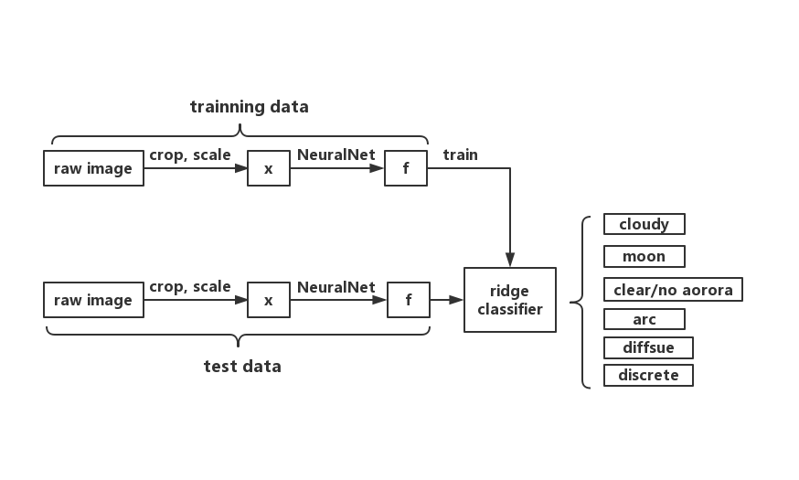

# Aurora borealis classification
### User story

### System diagram

### Methodology
#### 1) labels    
L = laebls {0,1,2,3,4,5}    

0 --> arc  

      This label is used for images that show one or multiple bands of aurora that stretch across the field-of-view;       
      typically,the arcs have well-defined, sharp edges    

1 --> diffuse     

      Images that show large patches of aurora, typically withfuzzy edges, are placed in this category.           
      The auroral brightnessis of the order of that of stars  

2 --> discrete    

      The images show auroral forms with well-defined, sharp edges,that are, however, not arc like.                    

3 --> cloudy     

      The sky in these images is dominated by clouds or the dome of the imager is covered with snow   

4 --> moon      

      The image is dominated by light from the Moon     
      
5 --> clear sky/no aurora     

      This label is attached to images which show a clearsky without the appearance of aurora    

#### 2) Image preparation
The images in our training data set originate from the THEMIS all-sky imager network.      
The raw auroral image is cropped insize by 15% in order to remove pixels that correspond to very low elevation angles

#### 3) Feature extraction

#### 4) Ridge classfication

